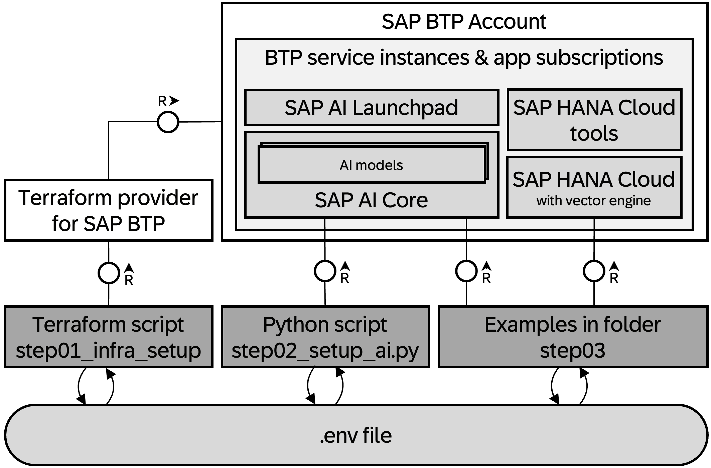
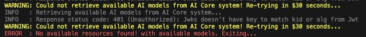

# SAP BTP genAI starter kit

<!--- Register repository https://api.reuse.software/register, then add REUSE badge:

-->

## Description

This repo wants to give users of the SAP Business Technology Platform (BTP) a quick way to learn how to use generative AI with BTP services.

## Requirements

- You have access to an SAP BTP global account or an existing SAP BTP sub account.
- `Visual Studio Code` is installed on your machine with the `Dev Container` extension. You understand purpose and basic concepts of [Dev Containers in VS Code](https://code.visualstudio.com/docs/devcontainers/containers).
- As prerequisite for using dev containers, `Docker` is installed on your machine and you understand its basics concepts.
- `Git` is available on your machine (test with `git --version`) and you know how to clone a project from github.
- The SAP BTP global account needs to be sufficiently entitled to use the following services and applications:

  | Name | Service/ Application | Plan |
  | --- | --- | --- | 
  | **AI Core** | `aicore` (service)| `extended` |
  | **AI Launchpad** (optional) | `ai-launchpad` (app subscription) | `standard` |
  | **HANA Cloud** | `hana-cloud` (service) | `hana` |
  | **HANA Cloud Tools** | `hana-cloud-tools` (app subscription) | `tools` |

## Download and Installation

### Step 1: Setup SAP BTP infrastructure

- Clone this GitHub repository to your local machine and open it in VS Code.
- Open the Dev Container on your machine from within VS Code (`Reopen in Dev Container`).
- Wait for the dev container to be built and the project to be loaded within it.
  >Be aware that opening the dev container can take a while! 
- In the folder [`config/secrets`](config/secrets) rename the file `btp_ai_setup.tfvars` to `my_btp_ai_setup.tfvars`.
    - adapt the value for `globalaccount` for the subaccount to be created within. You find in the global account landing page ("Subdomain: .....").
    - add your email address to the variable `admins`. This should be looking similar to this: `admins  = ["your.email@sap.com"]`.
    - save the file.
- In the folder [`config/secrets`](config/secrets) rename the file `btp_credentials.tfvars` to `my_btp_credentials.tfvars`.
    - adapt the value for the variable `BTP_USERNAME` to your email address.
    - save the file.
- Within VS Code open a terminal session. 
- In the terminal simply type `./run.sh` and enter your `BTP_PASSWORD` as well as the password for the `HANA DB` (you will be prompted accordingly).
  > Make sure that the password for the HANA DB matches the minimum requirements (length >= 8, 1+ upper case chars, 2+ lower case chars, 1+ digit)!

The startet script will now setup the following things for you in your SAP BTP global account:

- It creates a subaccount with the name configured in the `my_btp_ai_setup.tfvars` file (folder `config/secrets`).
- It creates service instances/subscriptions for the following services
    - SAP AI Core (service)
    - SAP HANA Cloud (service) with integrated vector engine
    - SAP HANA Cloud tools (app subscription)
- It creates a file called `.env` that will be copied into the [`config/secrets`](config/secrets) folder.

### Step 2: Deploy AI Models for your genAI experiments in AI Core

>The second step will automatically be taken care of by the running `./run.sh` command from step 1.
 After the successful setup of the BTP subaccount, it calls the python script `step02_fetch_metadata.py` in the folder [`scripts`](scripts).

That python script does the following:

- It loads the content of the newly created `.env` file from step 1 into the environment variables of the session.
- It calls the AI Core APIs to give you access to the models you have defined in the file [config/secrets/my_btp_ai_setup.tfvars](config/secrets/my_btp_ai_setup.tfvars) (through the variable `target_ai_core_model`).

### Step 3: Run GenAI examples

> After the steps above, you are all set for your first genAI experiments on SAP BTP.

You can proceed by switching to the folder [`scripts/step03_explore_examples`](scripts/step03_explore_examples).

Here you will find [some examples](scripts/step03_explore_examples/README.md) with respective instructions and sample code.

## Known Issues

> ❗There is an existing issue that makes AI Core API token invalid for about 1-2 hours after it was created. We implemented a retry mechanism, nevertheless, until the issue is resolved, running the `./run.sh` might result in the following error. 
As a temporary workaround, just re-run the `./run.sh` in 1-2 hours.

## How to obtain support
[Create an issue](https://github.com/SAP-samples/<repository-name>/issues) in this repository if you find a bug or have questions about the content.
 
For additional support, [ask a question in SAP Community](https://answers.sap.com/questions/ask.html).

## Contributing
If you wish to contribute code, offer fixes or improvements, please send a pull request. Due to legal reasons, contributors will be asked to accept a DCO when they create the first pull request to this project. This happens in an automated fashion during the submission process. SAP uses [the standard DCO text of the Linux Foundation](https://developercertificate.org/).

## License
Copyright (c) 2024 SAP SE or an SAP affiliate company. All rights reserved. This project is licensed under the Apache Software License, version 2.0 except as noted otherwise in the [LICENSE](LICENSE) file.
