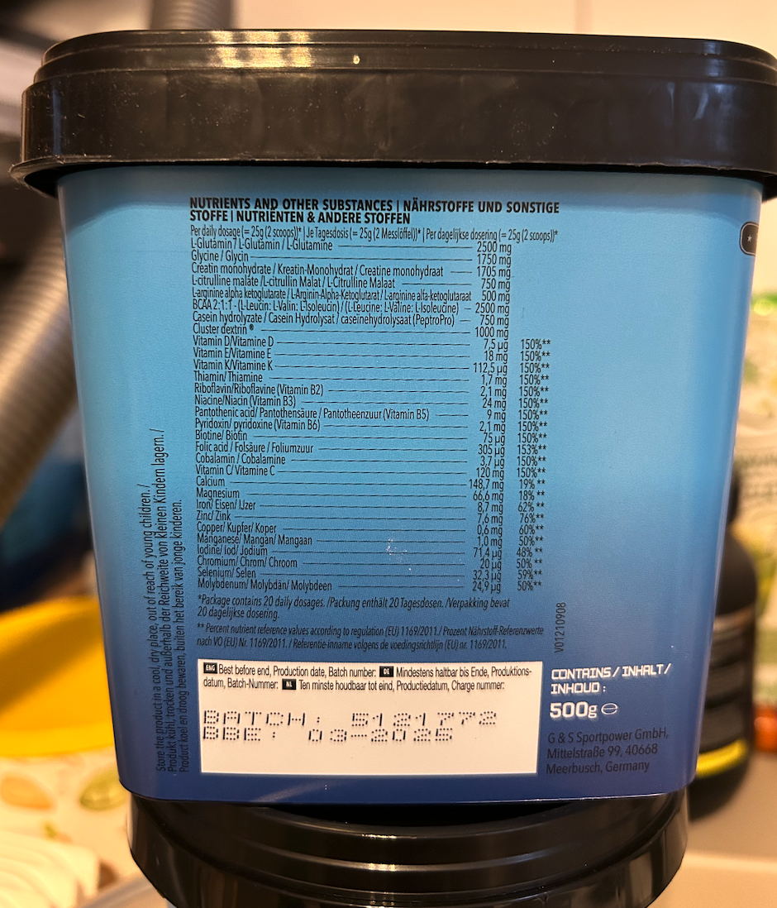

# Example: Multi Modality on BTP

The following sample demonstrates how multi modality can be used on BTP. The example uses the BTP GenAI service to to process images using an vision model.

## Installation

1. Create virtual environment

Poetry automatically creates and manages virtual environments. To create one for your project, run:

```sh
poetry install
```

This command creates a virtual environment and installs any dependencies specified in your pyproject.toml file.


2. Run the script

```sh
poetry run python main.py
```

And select one of the available options:
1. Visual Reasoning on Image
2. Read Tabular Data in Image

## 1. Visual Reasoning on Image

This example shows visual reasoning capabilities. It uses the following picture:


and a prompt that prescribes to detect potential risks based on the information provided in an image.


## 2. Read Tabular Data in Image
This example extracts tabular data from the provided image. It uses the following picture:



and a prompt that prescribes to extracting tabular data and formatting it as markdown.
