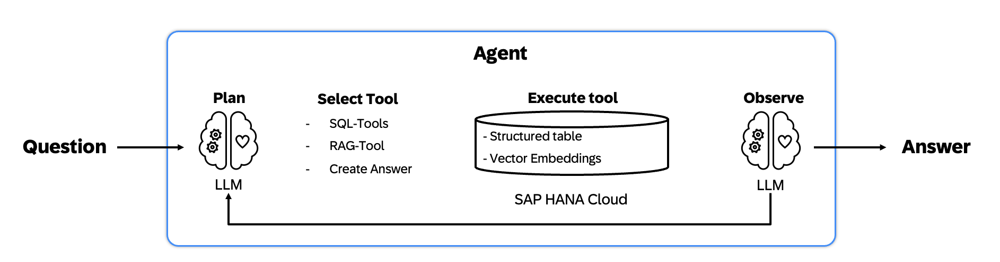

# Example: RAG on SAP BTP with structured and unstructured data
This example shows how to create a RAG application that uses both **structured** and **unstructured** data for grounding LLM responses.

## Installation

1. Create virtual environment

Poetry automatically creates and manages virtual environments. To create one for your project, run:

```sh
poetry install
```

This command creates a virtual environment and installs any dependencies specified in your pyproject.toml file.


2. Run the script

```sh
poetry run python main.py
```

And select one of the available options
0. Cleanup HANA DB
1. Run Data Ingestion
2. Run Retrieval Augmented Generation

## 1. Run Data Ingestion
We begin with data ingestion.
This time we use the following data for grounding:
 - Create table in SAP HANA DB with Information about City, Population and Country it belongs to.
 - Create table with embeddings of the Wikipedia pages that are related to the Cities. This example uses LangChain adapter for HanaDB Vector Engine to load sample documents that will be used for grounding the LLM responses.

## 2. Run Retrieval Augmanted Generation
Then we demonstrate *Retrieval Augmented Generation* app that can use both:
- Structured data stored in the tables in SAP HANA Cloud.
- Unstructured data from Wiki via SAP HANA Cloud Vector engine and SAP GenAI Hub.

We implement the application as a LangChain `SQL Agent` that uses SQLAlchemy dialect for SAP HANA for constructing the SQL Queries, and equip it with an additional custom RAG Tool for answering detailed questions about Cities.
The agent Iterates on the question presented by the user and uses REACT pattern choosing which tool to select on every iteration. This example requires `gpt-4` or `gpt-4o` model for the reliable results.

**Example questions:**
- *Can you give me the country corresponding to each city?* - This question corresponds to the structured data and can be answered by constructing and executing an SQL statement to the `city_stats` table in Hana DB.
- *Tell me about the history of Berlin.* - Answer on this question can not be found in the `city_stats` table and requires a call to the `RAGTool` for accessing relevant Wiki Pages info.
- *Tell me about the arts and culture of the city with the highest population.* - Answer to this question requires both, finding out the city with the highest population and using the `RAGTool` for accessing relevant Wiki Pages info.

## 3. Process Overview


